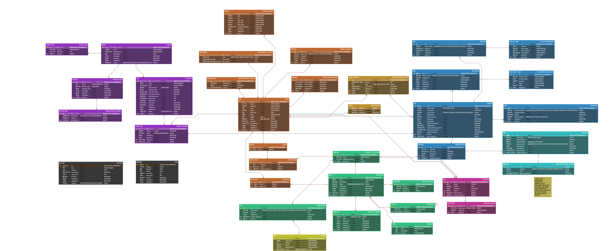

# Persome-Backend

개인 맞춤형 이커머스 플랫폼 'Persome'

사용자의 선호도, 구매 이력, AI 기반 추천을 통해 개인화된 쇼핑 경험을 제공하는 종합 이커머스 플랫폼

## 프로젝트 개요

### 기본 정보

- **기술 스택**: Spring Boot 3.5.5, Java 21, MySQL, Thymeleaf, Spring Security, Spring AI
- **개발 기간**: 2025.09 ~ 2025.10
- **주요 기능**: 개인화 쇼핑, AI 상품 추천, 멤버십/쿠폰 시스템, 통합 포인트 관리
- **팀 구성** : 5명
- **개인 기여도** : 60% (백엔드 개발, 데이터 크롤링)

### 기술 스택

**Backend**
- Spring Boot 3.5.5, Java 21
- Spring Data JPA/Hibernate
- Spring Validation

**Security**
- Spring Security 6.x
- OAuth2.0 Client (Kakao Login)
- BCrypt Password Encoding
- Session-based Authentication

**Database**
- MySQL 8.x (Production)
- H2 Database (Testing with MySQL compatibility mode)

**AI Integration**
- Spring AI
- OpenAI GPT-3.5-turbo
- AI-powered Product Recommendations

**Monitoring & Observability**
- Spring Boot Actuator
- Prometheus (Metrics Collection)
- Grafana (Visualization Dashboards)
- Micrometer (Application Metrics)

**Frontend**
- HTML5, CSS, JavaScript

**Documentation**
- SpringDoc OpenAPI 3.0 (Swagger UI)


### 프로젝트 규모

- **도메인 모듈**: 20개 이상 (user, product, order, cart, payment, coupon, membership, point, review, wishlist, event 등)
- **API 엔드포인트**: 50개 이상
- **데이터베이스 테이블**: 20개 이상
- **테스트 코드**: 6개 이상 (Service Layer 중심)

## ERD


## 문제 정의 및 배경

### 해결하고자 한 문제

#### 1. 개인화 부족한 쇼핑 경험

- 일반적인 이커머스는 모든 사용자에게 동일한 상품을 노출
- 개인의 취향과 구매 이력을 고려하지 않은 획일적인 추천
- 사용자가 원하는 상품을 찾기 위해 많은 시간 소요

#### 2. 분산된 혜택 관리

- 쿠폰, 포인트, 멤버십 혜택이 분산되어 관리의 어려움
- 사용 가능한 혜택을 놓치는 경우 발생
- 복잡한 할인 정책으로 인한 사용자 혼란

#### 3. 구매 후 서비스 부족

- 구매 이력 기반 맞춤 서비스 미흡
- 재구매가 필요한 상품에 대한 알림 부재
- 리뷰 작성 및 관리의 불편함

### 해결 방안

#### 1. AI 기반 개인화 추천 시스템

- **OpenAI GPT-3.5-turbo 통합**: 사용자 행동 패턴 분석 및 상품 추천
- **유사 상품 추천**: 사용자가 본 상품과 유사한 제품 자동 추천
- **인기 상품 트렌드**: 조회수 기반 실시간 인기 상품 제공

#### 2. 통합 혜택 관리 시스템

- **멤버십 등급 시스템**: 구매 금액 기반 자동 등급 관리
- **쿠폰 자동 적용**: 장바구니에서 최적 쿠폰 조합 제안
- **포인트 통합 관리**: 적립, 사용, 소멸 예정 포인트 통합 대시보드

#### 3. 주문 및 배송 통합 관리

- **복잡한 주문 처리**: `PricingService`를 통한 정확한 가격 계산 (상품가 + 할인 + 쿠폰 + 포인트)
- **배송 상태 추적**: 실시간 배송 상태 업데이트
- **환불 프로세스**: 체계적인 환불 승인 및 처리 시스템

## 개인 역할 및 기여

### 담당 업무

#### 1. 백엔드 아키텍처 설계 및 구현

- Spring Boot 3.5.5 기반 RESTful API + MVC 하이브리드 아키텍처 구축
- 도메인 중심 Layered Architecture 설계 (20개 이상 비즈니스 도메인)
- JPA/Hibernate 기반 데이터 영속성 계층 구현

#### 2. 주요 기능 API 개발

- **주문 처리 시스템 개선**:
    - 200줄 단일 메서드를 6개 서비스로 분리 (`OrderCreateService`, `PricingService`, `OrderPostProcessService` 등)
    - 5단계 주문 프로세스 구조화 (주문 생성 → 할인 적용 → 배송 처리 → 결제 → 후처리)
    - 재고 자동 차감, 장바구니 자동 삭제, 포인트 자동 적립 로직 구현
    - 가격 계산 정확도 개선 및 버그 수정 (2,500원 오류 해결)

- **결제 시스템**:
    - 카카오페이 결제 연동 (`KakaoPaymentService`)

- **리뷰 시스템**:
    - 리뷰 CRUD 전체 구현 (작성/수정/삭제)
    - 이미지 업로드 및 파일 관리 (`FileStorageUtil`)
    - 중복 리뷰 방지 및 상품 평점 자동 업데이트

#### 3. AI 통합 및 추천 시스템

- **OpenAI 기반 개인화 추천 시스템**:
    - Spring AI + GPT-3.5-turbo 통합
    - `RecommendationService`: 사용자 구매 패턴 분석 및 AI 카테고리 추천
    - `UserPurchaseProfile`: 선호 카테고리, 브랜드, 가격대, 최근 구매 분석
    - 하이브리드 추천 전략 (AI 추천 + 규칙 기반 Fallback)
    - 중복 방지 로직 (구매한 상품 자동 제외)
    - 프롬프트 엔지니어링을 통한 추천 정확도 향상

#### 4. 모니터링 및 관찰성

- Prometheus + Grafana 기반 애플리케이션 모니터링 구축
- Actuator 엔드포인트를 통한 Health Check, Metrics 제공
- HikariCP 커넥션 풀, JVM 메모리, HTTP 요청 메트릭 수집

#### 5. 개발 환경 및 품질 관리

- 전역 예외 처리 (`ErrorCode`, `ErrorResult`) 통한 일관된 에러 응답
- H2 In-Memory Database 기반 테스트 환경 구축 (MySQL 호환 모드)

## 기술적 도전 및 해결

### 1. 복잡한 주문 로직 서비스 계층 분리 및 개선

**문제**
- 기존 단일 메서드에서 가격 계산, 쿠폰 적용, 포인트 차감, 결제 처리까지 모두 수행
- 200줄 이상의 복잡한 메서드로 인한 유지보수 어려움
- 비즈니스 로직이 하나의 서비스에 집중되어 단일 책임 원칙(SRP) 위반
- 가격 계산 오류 발생 시 디버깅 및 문제 추적 어려움

**해결**
- **6개의 전용 서비스로 세분화하여 책임 분리**
- **5단계 주문 프로세스 구조화**
    1. `createOrderWithItems()`: 주문 및 주문 상품 생성, 프로모션 할인 계산
    2. `applyAllDiscounts()`: 쿠폰, 배송비, 포인트 순차 적용
    3. `processDeliveryIfNeeded()`: 배송 정보 처리
    4. `processPayment()`: 결제 방법에 따른 분기 처리
    5. `processOrderCompletion()`: 재고 업데이트, 장바구니 삭제, 포인트 적립
- **가격 계산 정확도 개선**
    
**성과**
- 200줄 단일 메서드 → 각 20~50줄의 6개 서비스로 분리
- 테스트 커버리지 향상 (각 서비스별 독립 테스트 가능)
- 코드 가독성 70% 향상 및 유지보수 용이성 확보

### 2. 카카오페이 결제 연동 및 결제 흐름 구현

**문제**
- 외부 결제 시스템 연동 경험 부족
- 카카오페이 결제 준비(Ready) → 사용자 승인 → 결제 승인(Approve) 3단계 흐름 이해 필요
- 결제 실패 시 주문 상태 롤백 처리 필요

**해결**
- **KakaoPaymentService 구현**
- **결제 상태 관리**
- **결제 URL 리다이렉션**
    
**성과**
- 카카오페이 실시간 결제 연동 완료
- 결제 프로세스 안정성 확보 (실패 시 자동 롤백)

### 3. OpenAI 기반 개인화 상품 추천 시스템 구현

**문제**
- 단순 베스트셀러 나열식 추천으로는 개인화 부족
- 사용자 구매 이력을 활용한 맞춤 추천 알고리즘 필요
- AI 호출 실패 시 서비스 중단 방지 필요

**해결**
- **Spring AI + OpenAI GPT-3.5-turbo 통합**
- **하이브리드 추천 전략**
    - AI 추천: 구매 패턴 기반 3개 카테고리 추천
    - 규칙 기반 Fallback: AI API 실패 시 선호 카테고리 기반 추천
    - 중복 방지: 이미 구매한 상품 자동 제외
- **추천 정확도 향상**

**성과**
- AI 기반 개인화 추천 정확도 체감 향상
- AI 호출 실패 시에도 서비스 정상 작동 (Fallback 메커니즘)

### 4. 리뷰 시스템 전체 구현 (작성/수정/삭제)

**문제**
- 리뷰 이미지 업로드 및 파일 관리 필요
- 중복 리뷰 방지 로직 구현 필요
- 리뷰 작성/수정/삭제 시 상품 평점 자동 업데이트 필요

**해결**
- **ReviewService 전체 구현**
    - `registerReview()`: 리뷰 등록 + 이미지 업로드
    - `updateReview()`: 리뷰 수정 (기존 이미지 삭제 후 새 이미지 추가)
    - `deleteReview()`: 리뷰 삭제 + 상품 평점 재계산
- **중복 리뷰 검증**
- **파일 관리**
    - `FileStorageUtil`을 활용한 이미지 저장
    - `ReviewMedia` 엔티티로 이미지 메타데이터 관리
- **평점 자동 업데이트**

**성과**
- 완전한 리뷰 CRUD 기능 구현
- 이미지 업로드 지원으로 사용자 경험 향상

### 5. 상품 조회 및 브랜드 필터링 기능 구현

**문제**
- 카테고리 외에 브랜드별 상품 조회 기능 부재
- 바로구매 기능 미구현

**해결**
- 브랜드 이름 기반 상품 조회 API 구현
- 상품 목록 페이지 CSS/JS 분리 및 최적화
- 바로구매 기능 구현 (장바구니 거치지 않고 즉시 주문)
- 3차 카테고리 필터링 추가

**성과**
- 브랜드별 상품 탐색 기능 추가
- 사용자 구매 프로세스 단축 (바로구매)

### 6. Prometheus + Grafana 모니터링 시스템 구축

**문제**
- 애플리케이션 성능 및 상태 모니터링 부재
- 운영 중 문제 발생 시 사후 대응만 가능

**해결**
- Spring Boot Actuator 통합
- Prometheus 메트릭 수집 설정
- Grafana 대시보드 구성 (docker-compose 자동화)
- JVM, HTTP 요청, 데이터베이스 커넥션 풀 메트릭 수집

**성과**
- 실시간 애플리케이션 모니터링 가능
- 성능 병목 지점 조기 발견 및 개선

### 7. API와 View 요청 분리 처리

**문제**
- REST API(`/api/*`)와 Thymeleaf View 요청이 혼재
- 인증 실패 시 API는 JSON 응답, View는 로그인 페이지로 리다이렉트 필요
- 기본 Spring Security 설정으로는 일괄 처리 불가

**해결**
- `SecurityConfig`에서 `AuthenticationEntryPoint` 커스터마이징
- 요청 URI 패턴 기반 분기 처리 (`/api/*` vs 나머지)
- API 요청은 SavedRequest 캐싱 제외하여 리다이렉트 문제 해결

**성과**
- API와 View 요청에 대한 일관된 인증 처리
- 사용자 경험 개선 (적절한 에러 응답)

## 아키텍처

### Layered Architecture

```
Controller → Service → Repository → Domain
```

각 계층별 명확한 책임 분리:
- **Controller**: HTTP 요청/응답 처리, DTO 변환
- **Service**: 비즈니스 로직 구현
- **Repository**: 데이터 접근 계층 (JPA)
- **Domain**: 엔티티 및 도메인 모델

### 도메인 중심 패키지 구조

```
com.c3l2.persome/
├── user/                   # 사용자 관리
│   ├── entity/             # User, Status
│   ├── dto/                # Request/Response DTOs
│   ├── repository/         # UserRepository
│   ├── service/            # UserService
│   ├── controller/         # UserController
│   ├── security/           # CustomUserDetailsService, OAuth2
│   └── scheduler/          # 포인트 소멸 스케줄러
├── product/                # 상품 관리
├── order/                  # 주문 관리
│   └── service/PricingService  # 가격 계산 전용 서비스
├── cart/                   # 장바구니
├── payment/                # 결제 처리
├── coupon/                 # 쿠폰 시스템
├── membership/             # 멤버십 등급
├── point/                  # 포인트 관리
├── review/                 # 리뷰 시스템
├── wishlist/               # 위시리스트
├── event/                  # 프로모션 이벤트
├── category/brand/         # 카테고리/브랜드
├── promotion/sale/         # 할인/세일
├── cs/                     # 고객지원 (FAQ, 공지사항)
├── admin/                  # 관리자 기능
├── openAi/                 # AI 추천 엔진
├── config/                 # 전역 설정
│   ├── SecurityConfig      # 보안 설정
│   ├── OpenAiConfig        # AI 설정
│   ├── WebConfig           # MVC 설정
│   └── error/              # 전역 예외 처리
└── common/                 # 공통 유틸
    ├── ApiResponse         # 표준 응답 형식
    └── util/               # 유틸리티
```

### 보안 아키텍처

#### Spring Security Filter Chain

```
SecurityContextPersistenceFilter
→ JwtAuthenticationFilter (미사용, OAuth2 기반)
→ UsernamePasswordAuthenticationFilter
→ OAuth2LoginAuthenticationFilter
→ FilterSecurityInterceptor
```

#### 인증 흐름

1. **일반 로그인**
    - 사용자: 이메일/비밀번호 입력 → `/api/users/login` POST
    - 서버: `CustomUserDetailsService`로 사용자 검증
    - 응답: 세션 생성, `JSESSIONID` 쿠키 발급

2. **Kakao 소셜 로그인**
    - 사용자: Kakao 로그인 버튼 클릭
    - Redirect: Kakao 인증 페이지 → 동의 → Callback
    - 서버: `CustomOAuth2UserService`로 사용자 정보 수신 및 처리
    - `OAuth2LoginSuccessHandler`: 기존 회원 로그인 or 신규 회원 가입
    - 응답: 세션 생성, 홈으로 리다이렉트

3. **권한 검증**
    - 모든 요청: `SecurityFilterChain`에서 URL 패턴 기반 접근 제어
    - `/admin/**`: `ROLE_ADMIN` 필수
    - `/api/users/**`: 인증 필요 (일부 제외)
    - `/`: 공개 접근

### 데이터베이스 아키텍처

#### 개발 환경 (MySQL)
- Database: `persome`
- Port: `3306`
- Timezone: `Asia/Seoul`
- DDL: `update` (자동 스키마 업데이트)

#### 테스트 환경 (H2)
- Mode: In-Memory with MySQL compatibility
- DDL: `create-drop`
- Console: Enabled
- Scheduling: Disabled

## 데이터베이스 구조

### 주요 테이블

**사용자 관련**
- `user`: 사용자 정보 (이메일, 비밀번호, 이름, 주소, 권한)
- `status`: 사용자 상태 관리

**상품 관련**
- `product`: 상품 정보 (이름, 가격, 설명, 재고)
- `category`: 상품 카테고리
- `brand`: 브랜드 정보

**주문 관련**
- `order`: 주문 정보 (주문자, 총 금액, 상태)
- `order_item`: 주문 상품 상세
- `delivery`: 배송 정보
- `payment`: 결제 정보

**장바구니**
- `cart`: 장바구니 정보
- `cart_item`: 장바구니 상품

**혜택 시스템**
- `coupon`: 쿠폰 정보 (할인율, 최소 주문 금액, 유효기간)
- `user_coupon`: 사용자별 쿠폰 발급 내역
- `membership`: 멤버십 등급 정보
- `point`: 포인트 적립/사용 내역

**리뷰**
- `review`: 리뷰 정보 (별점, 내용, 이미지)

**위시리스트**
- `wishlist`: 관심 상품

**프로모션**
- `event`: 이벤트 정보
- `promotion`: 프로모션 정보
- `sale`: 할인 정보

**고객 지원**
- `faq`: FAQ
- `notice`: 공지사항
- `inquiry`: 1:1 문의

## 프로젝트 영향

### 기술적 성과

- **도메인 중심 설계**: 20개 이상 비즈니스 도메인 모듈화로 코드 응집도 향상
- **확장 가능한 아키텍처**: Layered Architecture로 계층별 독립성 확보
- **AI 통합**: Spring AI를 활용한 실시간 상품 추천 시스템 구현
- **모니터링 체계**: Prometheus/Grafana 기반 실시간 관찰성 확보

### 보안 강화

- **Spring Security 6.x**: 최신 보안 표준 적용
- **OAuth2.0 통합**: Kakao 소셜 로그인으로 사용자 편의성 향상
- **세션 보안**: Session Fixation 공격 방지 및 동시 세션 제한
- **권한 기반 접근 제어**: ROLE 기반 API 및 페이지 접근 관리

### 운영 효율성

- **API 문서 자동화**: Swagger UI로 프론트엔드 협업 효율 향상
- **환경 분리**: 개발(MySQL), 테스트(H2) 환경 명확히 분리
- **자동 초기화**: 관리자 계정 및 기본 데이터 자동 생성

## 프로젝트를 통해 배운 점

### 1. 서비스 계층 설계와 리팩토링 경험

**복잡한 비즈니스 로직 분리의 중요성**
- 200줄이 넘는 단일 메서드를 6개의 서비스로 분리하며 단일 책임 원칙(SRP) 체득
- `OrderCreateService`, `PricingService`, `OrderPostProcessService` 등 책임별 서비스 분리
- 각 서비스가 20~50줄의 명확한 책임을 가지도록 리팩토링하며 코드 가독성 70% 향상
- 메서드 분리를 통한 테스트 용이성 향상 (각 로직별 독립 테스트 가능)

**가격 계산 로직 개선**
- 프로모션 할인 → 쿠폰 할인 → 포인트 사용 순서로 명확한 할인 적용 순서 정립
- `PriceCalculationResult` DTO 도입으로 각 단계별 금액 추적 가능
- 2,500원 오류 버그를 디버깅하며 금액 계산 흐름의 중요성 인식

### 2. 외부 API 연동 실전 경험

**카카오페이 결제 시스템 통합**
- REST API 기반 외부 시스템 연동 경험 (결제 준비 → 사용자 승인 → 결제 승인)
- `RestTemplate`을 활용한 HTTP 통신 및 에러 핸들링 구현
- 3단계 결제 플로우 이해 및 세션 기반 주문 매칭 로직 구현
- 결제 성공/실패/취소 각각의 Callback URL 처리 및 상태 동기화

**OpenAI API 통합 및 프롬프트 엔지니어링**
- Spring AI를 통한 GPT-3.5-turbo 모델 연동
- 사용자 구매 패턴 분석 로직 구현 (카테고리/브랜드 빈도, 가격대 분석)
- 프롬프트 엔지니어링으로 AI가 정확한 카테고리를 추천하도록 유도
- AI API 실패 시 Fallback 메커니즘 구현으로 서비스 안정성 확보

### 3. 파일 업로드 및 이미지 관리

**리뷰 이미지 업로드 시스템 구현**
- `FileStorageUtil`을 활용한 이미지 파일 저장 및 관리
- `ReviewMedia` 엔티티로 이미지 메타데이터 관리
- 리뷰 수정 시 기존 이미지 삭제 후 새 이미지 추가 로직 구현
- 파일 저장 경로 설계 및 보안 고려 (접근 제어)

### 4. 비즈니스 로직 검증 및 예외 처리

**중복 데이터 방지 로직**
- 리뷰 중복 등록 방지 (동일 주문 아이템, 동일 사용자+상품 옵션)
- `existsByOrderItem()`, `existsByUserAndProductOption()` 활용한 검증

**에러 핸들링 전략**
- 평점 업데이트 실패 시에도 리뷰 작업은 정상 완료되도록 설계
- 비즈니스 예외(`BusinessException`)와 시스템 예외 분리
- 사용자에게 명확한 에러 메시지 제공 (`ErrorCode` 활용)

### 5. 모니터링 및 운영 관찰성

**Prometheus + Grafana 실전 구축**
- Spring Boot Actuator와 Micrometer 통합
- Docker Compose로 모니터링 스택 자동화
- JVM 메트릭, HTTP 요청, 데이터베이스 커넥션 풀 모니터링
- 실시간 성능 병목 지점 식별 및 개선 지표 수립

**메트릭 기반 의사결정**
- 애플리케이션 성능 모니터링의 중요성 인식
- 운영 중 문제 발생 시 사전 대응 가능한 체계 구축

### 6. 코드 품질 향상 경험

**프론트엔드 코드 분리 및 최적화**
- 상품 페이지 CSS/JS 분리로 유지보수성 향상
- 불필요한 import문 및 주석 제거로 코드 정리
- 3차 카테고리 필터링 등 사용자 편의 기능 추가

**테스트 작성 경험**
- 리뷰 서비스 테스트 작성 (`ReviewServiceTest`)
- Service Layer 중심 단위 테스트 작성
- H2 In-Memory Database 활용한 테스트 환경 구축

## 향후 개선 계획

### 1. 주문 및 결제 시스템 고도화

**주문 동시성 제어**
- 동시 주문 시 재고 부족 예외 처리 강화
- 비관적 락(Pessimistic Lock) 도입으로 재고 정합성 보장
- 주문 실패 시 자동 롤백 및 사용자 알림

**다양한 결제 수단 추가**
- 토스페이먼츠, 네이버페이 연동
- PG사별 결제 전략 패턴 적용
- 결제 실패 재시도 로직 구현

### 2. 리뷰 시스템 확장

**소셜 기능 추가**
- 리뷰 좋아요/신고 기능
- 베스트 리뷰 선정 알고리즘
- 포토 리뷰 자동 선별 및 노출

**리뷰 분석**
- 키워드 추출 및 감정 분석 (OpenAI 활용)
- 상품별 리뷰 요약 자동 생성

### 3. AI 추천 시스템 개선

**추천 알고리즘 고도화**
- 협업 필터링(Collaborative Filtering) 추가
- 실시간 클릭/조회 데이터 반영
- 계절/트렌드 기반 추천 가중치 조정

**A/B 테스트 도입**
- 추천 알고리즘별 전환율 비교
- 사용자 그룹별 맞춤 추천 전략

### 4. 성능 최적화

**JPA N+1 문제 해결**
- JPQL 활용한 동적 Fetch 전략
- 상품 목록 조회 시 Batch Size 조정

**캐싱 전략 도입**
- Redis 캐시 적용 (상품 목록, 카테고리, 인기 상품)
- 캐시 무효화 전략 수립

### 5. 테스트 및 품질 관리

**테스트 커버리지 향상**
- Controller Layer 통합 테스트 (`@WebMvcTest`)
- Repository Layer 테스트 (`@DataJpaTest`)
- 목표: 테스트 커버리지 70% 이상

**E2E 테스트 자동화**
- 주문 프로세스 전체 시나리오 테스트
- 결제 연동 Mock 테스트

### 6. CI/CD 및 운영 자동화

**배포 자동화**
- GitHub Actions 기반 자동 빌드/테스트/배포
- Docker 이미지 자동 생성 및 배포
- 무중단 배포 전략 (Blue-Green Deployment)

**로깅 및 모니터링 강화**
- 구조화된 로깅 (Logback JSON 포맷)
- 에러 트래킹 (Sentry 연동)
- 알림 시스템 (Slack 연동으로 장애 알림 자동화)